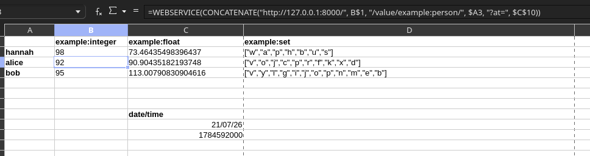

# TARDIS

TODO: Figure out what the acronym is

---

## About
TARDIS is a data store for statistics, especially in competetive games & sport. The motivation was a desire for a simple end-user experience while giving great power to administrators where they need it.

The system works on this design: fields (e.g. `football:goals`) have datatypes (e.g. `tardis:numeric:integer`) which have getters (e.g. `tardis:numeric:value`) and setters (e.g. `tardis:numeric:increment`) to modify/read the field's value for a given subject (e.g. `football:player/wayne-rooney`)

Lastly, everything is done in transactions known as events. These are different to transactions in the traditional sense, because they are reversible even after they have been committed.

## Example use-case

Let's say you're running a competetive FPS tournament. Kills, deaths, assists, health, etc. are all tracked in the store. You can query the exact values at any moment for your dataviz needs.

But disaster strikes! A bug has caused an issue with one specific kill (and death) and it has to be subtracted from the score. Did you remember to add that redundancy you promised you would? Probably not. I wouldn't have. This system lets you identify & delete that singular event easily, and nothing explodes if you do.

And if your old-fashioned coworker can't fathom using anything other than spreadsheet software, well, of course you can use it like that!

## Contributing

Please feel free! This was made as a project for a small team working on competetive virtual tournaments, but I can imagine the use cases exist elsewhere. If you have a bug, submit an issue.
