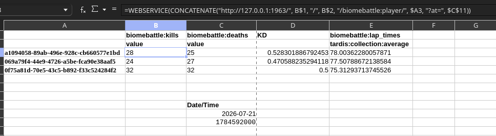

# TARDIS

TODO: Figure out what the acronym is

---

## About
TARDIS is a data store for statistics, especially in competetive games & sport. The motivation was a desire for a simple end-user experience while giving great power to administrators where they need it.

The system works on this design: fields (e.g. `football:goals`) have datatypes (e.g. `tardis:numeric:integer`) which have getters (e.g. `tardis:numeric:value`) and setters (e.g. `tardis:numeric:increment`) to modify/read the field's value for a given subject (e.g. `football:player/wayne-rooney`)

Lastly, everything is done in transaction-like updates known as events. These are different to transactions in the traditional sense, because they are reversible even after they have been committed. This allows you to query the value of things historically, or to count events within a period of time.

## Example use-case

Let's say you're running a competetive FPS tournament. Kills, deaths, assists, health, etc. are all tracked in the store. You can query the exact values at any moment for your dataviz needs.

But disaster strikes! A bug has caused an issue with one specific kill (and death) and it has to be subtracted from the score. Did you remember to add that redundancy you promised you would? Probably not. I wouldn't have. This system lets you identify & delete that singular event easily, and nothing explodes if you do.

And if your old-fashioned coworker can't fathom using anything other than spreadsheet software, well, of course you can use it like that!



## Usage
```python
from tardis import TARDIS

tardis = TARDIS("YOUR_DATABASE_URI")

# ... configuration ...

tardis.serve(host="0.0.0.0", port=1963) # Hosts via uvicorn over HTTP
```

### Adding fields
```python
# Register a field with its name and its datatype
tardis.register_field("myorg:integer", "tardis:numeric:integer")
tardis.register_field("myorg:float",   "tardis:numeric:float")
tardis.register_field("myorg:set",     "tardis:set")
tardis.register_field("myorg:list",    "tardis:list")
```

### Getting and setting over HTTP
```bash
# Get the current value of `example:list` for `example:person/hannah`
curl "http://127.0.0.1:1963/example:list/value/example:person/hannah"

# Set the current value of `example:list` for `example:person/hannah`
curl "http://127.0.0.1:1963/example:list/value/example:person/hannah" --json "[1,2]"

# Get the current value of `example:list` for `example:person/hannah` at <timestamp> (unix seconds)
curl "http://127.0.0.1:1963/example:list/value/example:person/hannah?at=<timestamp>"

# Append (using a setter, `tardis:list:append`) to a list for `example:person/hannah`
curl "http://127.0.0.1:1963/example:list/value/example:person/hannah" --json "3"

# Update two fields in a single event
curl "http://127.0.0.1:1963/example:integer/tardis:integer:delta/example:person/alice?event=35253c30-cda8-4dcc-ab54-3552257ad8c9" --json "1"
curl "http://127.0.0.1:1963/example:integer/tardis:integer:delta/example:person/bob?event=35253c30-cda8-4dcc-ab54-3552257ad8c9" --json "-1"
```

### Custom types
```python
tardis.register_datatype("myorg:mytype", MyType)
```
You will also need to register a default getter and setter, for the `value`:
```python
tardis.register_value_modifiers("myorg:mytype", "myorg:mytype:value", "myorg:mytype:value")
```
Where `myorg:mytype:value` represents a getter and a setter method. You can use any method that is compatible with your type (e.g. the setter `tardis:simple:value` simply stores the sent JSON object)

### Custom getters and setters
```python
from fastapi import Depends
from typing import Annotated
from datetime import datetime

@tardis.getter(["myorg:mytype"], "myorg:mytype:mygetter")
async def my_type_getter(
        db: Annotated[Session, Depends(tardis.db)],
        field: str, subject_type: str, subject_identifier: str,
        at: datetime = None,
        default=None) -> MyType:
    
    # ... database access ...
    # ... processing ...

    return result
```

Custom setters work in a similar way, but instead of returning, the `FieldUpdate` is added to the database:
```python
db.add(FieldUpdate(
    id=uuid4(),
    event=event,
    field=field,
    setter=setter,
    subject_type=subject_type,
    subject_identifier=subject_identifier,
    body=body,
    updated_at=datetime.now(timezone.utc),
    params=params,
))
db.commit()
```

## Contributing

Please feel free! This was made as a project for a small team working on competetive virtual tournaments, but I can imagine the use cases exist elsewhere. If you have a bug, submit an issue.
